# LowRes NX
This repository contains several demos and games I created for the LowResNX virtual console.

You can download the virtual console for free from the LowRes NX website:
https://lowresnx.inutilis.com/

## Demos

### Copper bars
A copper bars demo in the style which could be shown on the Commodore 64 or Amiga computers. This demo uses the raster function to achieve the effect.

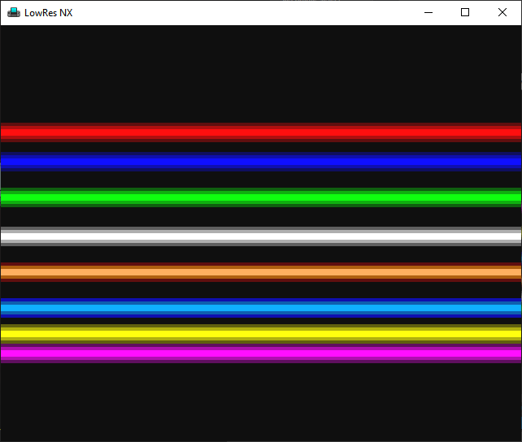

### Fade In/out
This is a palette fader effect, you can fade in or fade out the whole screen.

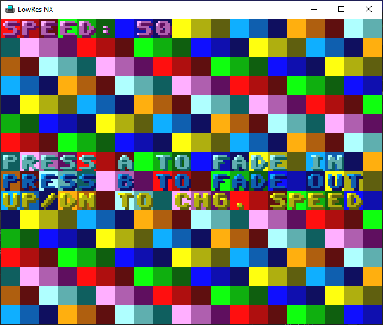

### Final Fantasy Combat Scene
A combat scene inspired from the Final Fantasy games (it's also a trubute to these games).

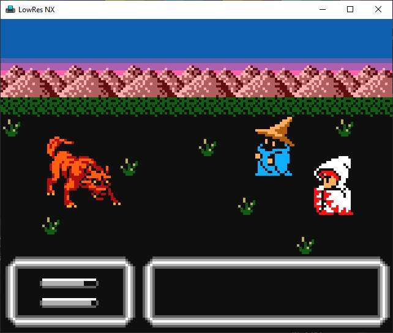

### Isometric 3d game engine
This is an isometric 3d game engine core.

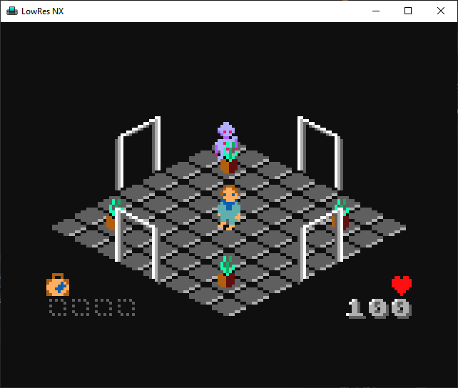

### Lighting Works
A directional light and point light demo. You change between lights by pressing B.

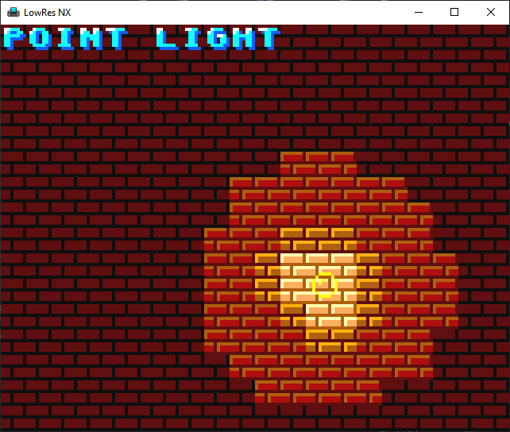

### Stars 3D
A 3D star field.

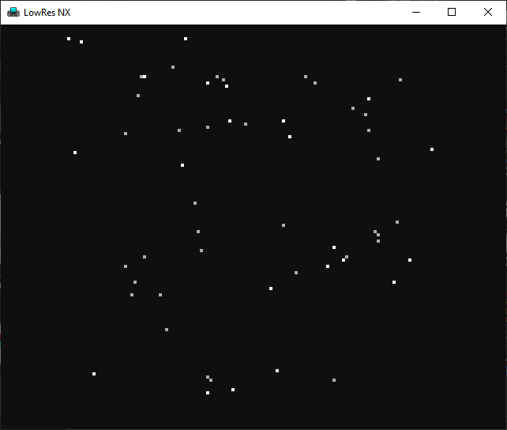

### The Landscape
A deep parallax scrolling effect as the one who was visible in the Shadow Of The Beast games. The scrolling takes advantage of the raster function available in the LowRes NX console.

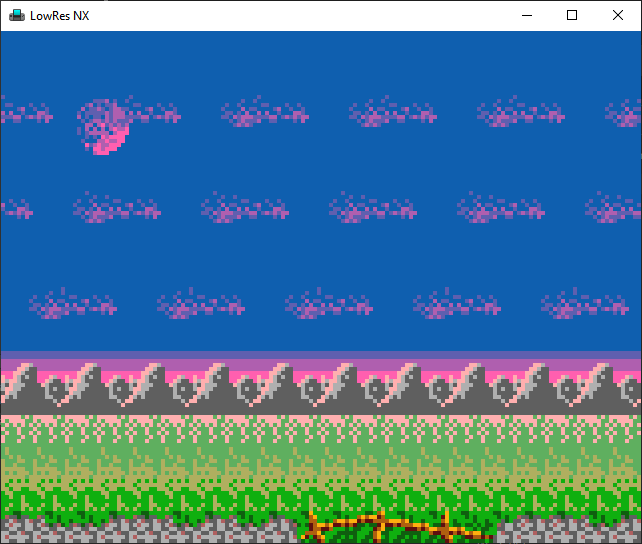

## Games

### LowResArka
This is an Arkanoid clone. The game contains the 32 levels, although simplified to fit in the available resolution, and the final boss.

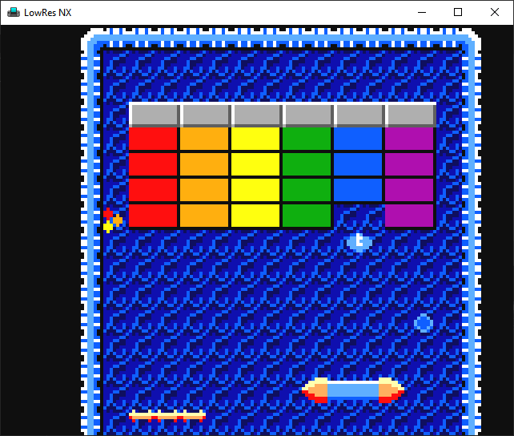

### The Forgotten Treasure
This is a small arcade and puzzle game, containing 12 levels. You're an adventurer which want to steal a legendary treasure, but the place is haunted and well guarded.

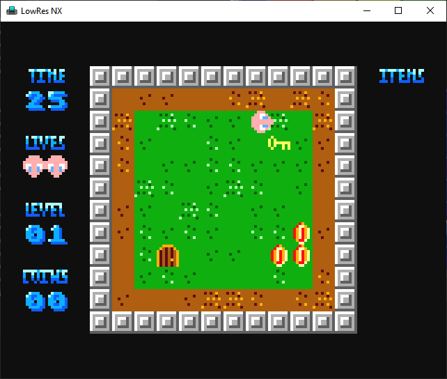

### Trapped!
This is a 3d isometric game, in which you're trapped in your office, for an unknown reason, and you try to escape to the traps which appeared here.

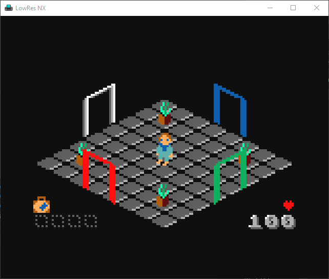

### Centipede
This is a LowResNX port of the Centipede arcade game from 1980.

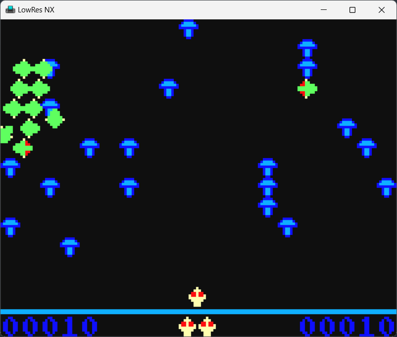
